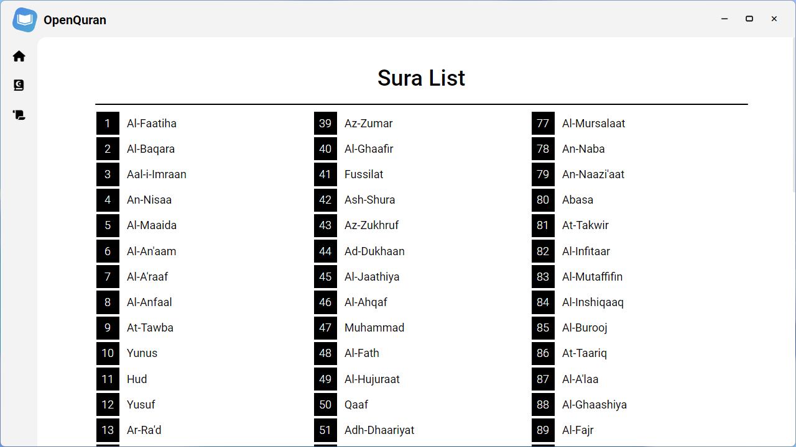
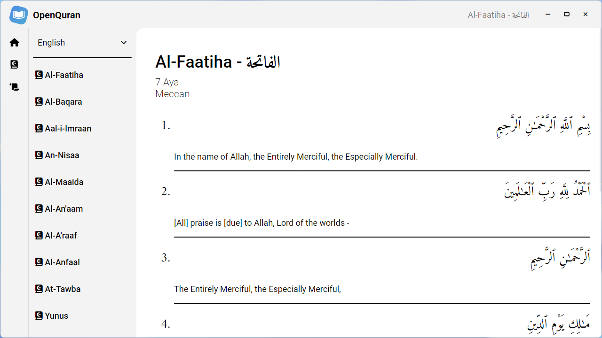
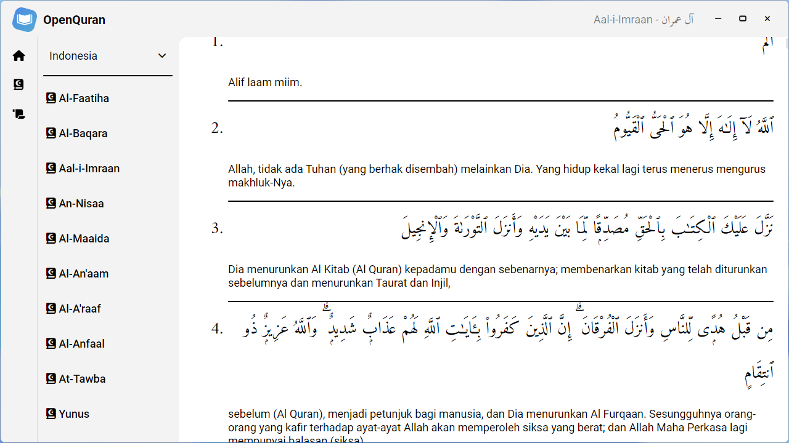
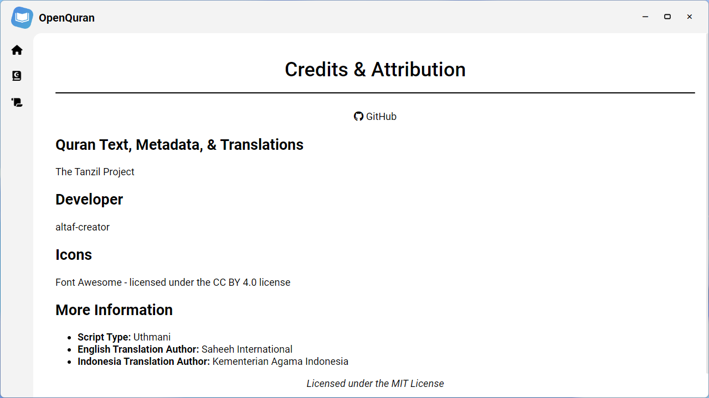

# OpenQuran

ِبِسْمِ اللَّهِ الرَّحْمَنِ الرَّحِيْم

السَّلاَمُ عَلَيْكُمْ وَرَحْمَةُ اللهِ وَبَرَكَاتُهُ

OpenQuran is an online & offline (for Windows) Al-Qur'an Reader website & app. 

## Features

- Al-Qur'an
- Sura List
- Translation
	- English
	- Indonesia
- Zooming

## Installation

### Download from Releases (Windows)
1. Download the .zip file [here](https://github.com/altaf-creator/OpenQuran/releases/tag/v1.1.0)
2. Unzip the file
3. Open the `OpenQuran` shortcut on the unzipped root folder **OR** navigate to `\OpenQuran-win32-x64` then open `OpenQuran.exe`

### Compile using Electron Forge
1. Clone the repository using `git clone https://github.com/altaf-creator/OpenQuran.git`
2. Navigate to OpenQuran
3. Install dependencies using `npm install`
4. To preview your electron app, run `npm start`
5. To build your electron app, run `npm run make`

### Add to Homescreen (Browser)
1. Open OpenQuran's website [here](https://altaf-creator.github.io/OpenQuran/)
2. Click your browser's menu (usually ⋯)
3. Click "Add to Homescreen" or "Install App"

## Screenshots

## Credits & Attribution

- [The Tanzil Project](https://tanzil.net)
- [Made with Electron](https://www.electronjs.org/)